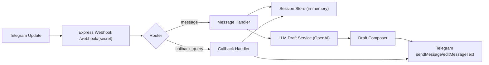
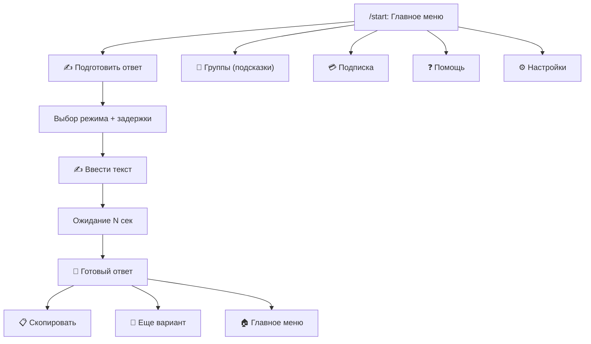

# Telegram Bot Architecture

## 1) Components

## 2) Screen Map

## 3) Session Model

- `mode`: `normal | short | polite | tothepoint | refuse | busy`
- `delaySec`: `10 | 20`
- `awaitingInput`: bot waits for user message to draft
- `lastIncomingText`: latest source message for regenerate
- `lastDraft`: latest generated reply
- `trialActivated`: unlock premium modes
- `pendingTimer/pendingToken`: safe delayed generation

## 4) UX Principles (from reference)

- One clear action first: `✍️ Подготовить ответ`
- Always show explicit next step after each screen
- Keep answer card copy-friendly and compact
- Premium upsell only after user got first value
- Group mode explains limitation: bot does not send on behalf of user
